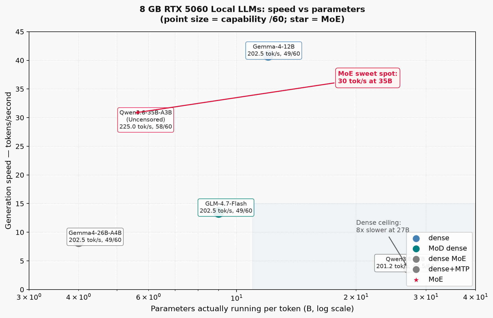

# Qwen3.6-35B-A3B Uncensored on 8 GB: The MoE That Won The Sweet Spot — Five Local LLMs, One Chart

> Repo: [Ultramanmao/ai-pipeline-local](https://github.com/Ultramanmao/ai-pipeline-local)
> Benchmark hardware: AMD Ryzen 7 H 260 (16T) / RTX 5060 Laptop 8 GB / 32 GB RAM / sm_120 (Blackwell)
> Date: 2026-08-18
> Series: part 2 of the local LLM arc — extends [v14.0 Five Models, Six Tests](docs/releases/v14.0_8GB-Local-LLM-Benchmark-Five-Models-Six-Tests.md) with correct MoE configuration, adds Qwen3.8-27B challenger, and publishes the speed-vs-parameters scatter plot.

---

## TL;DR

I spent a day chasing the new Qwen3.8-27B, thought I'd finally have a reason to retire my Qwen3.6-35B-A3B Uncensored main, and ended up proving the opposite.

Ran Qwen3.8-27B Q4_K_M through the same 6-question, 6-dimension benchmark that produced [v14.0](docs/releases/v14.0_8GB-Local-LLM-Benchmark-Five-Models-Six-Tests.md). Result: **48.5/60 vs 58/60 for the 35B main** — no edge on capability. And on speed, the 27B dense model runs at **3.82 tok/s vs 30.79 tok/s** for the 35B — **8× slower**, on the same 8 GB card.

The 8× gap isn't the model — it's the architecture. Qwen3.6-35B is a 35B MoE (8 experts, 2 active per token), and on this host the correct config (`--gpu-layers 99 --cpu-moe --ctx-size 32768 --flash-attn auto --jinja`) lets llama.cpp offload the dense expert weights to the GPU and the inactive routing layers to the CPU. Qwen3.8-27B is dense + MTP (multi-token prediction), `--cpu-moe` does nothing to it (empirically +0.01 tok/s), and its MTP speculative-decoding head isn't consumed by the current ggml-org llama.cpp build — `--spec-draft-*` all require an external draft model.

**Keep Qwen3.6-35B as the main. Keep Qwen3.8-27B as the multimodal backup** (image input, which 35B lacks). Rerun when llama.cpp natively consumes GGUF MTP heads.

---

## Why I looked at Qwen3.8 at all

The trigger was the new model drop. Qwen3.6-35B is an older A3B MoE; Qwen3.8-27B is the successor, smaller parameter count on paper, supports image input, ships with an MTP head that theoretically generates several output tokens per forward pass. On a spec sheet, it looks like the upgrade.

The mistake was assuming the parameters tell you what runs well. They don't. They tell you what was measured in a training lab with the whole stack wired in — not on a laptop 5060 with 8 GB.

---

## The first trap: I misclassified the architecture

When I first hit 1.05 tok/s on Qwen3.8, my reflex was "MoE model, forgot `--cpu-moe`" — because that's the fix that gave 35B its 8 GB viability in the first place.

Checked `config.json`:

| Field | Present? |
|-------|----------|
| `num_local_experts` | ❌ not in file |
| `num_experts_per_tok` | ❌ not in file |
| `architectures` | `['Qwen3_5ForConditionalGeneration']` |

Qwen3.8-27B is **dense**, not MoE. The MTP head is a separate prediction layer, not an expert routing mechanism. `--cpu-moe` on a dense model is a no-op — empirically verified, see below.

This is the kind of error that costs half a day: carrying the configuration instinct from one model onto the next without checking the architecture. v14.0 never had this problem because Qwen3.6-35B is unambiguously MoE; Qwen3.8 being a dense-with-MTP hybrid looks like MoE until you read the config.

**Lesson: read config.json before reaching for `--cpu-moe`.**

---

## The second trap: `ngl` sweet spot for Qwen3.8

`llama-bench` ngl scan (Qwen3.8-27B Q4_K_M, r=3, batch=2048, threads=16, `--ctx-size` default):

| ngl | pp512 tok/s | tg64 tok/s | VRAM | Notes |
|-----|-------------|------------|------|-------|
| 40  | 32.89 ± 1.36 | 1.04 ± 0.01 | 7599 MB | MTP head on CPU → prompt processing collapses |
| 30  | 33.15 ± 0.03 | 2.58 ± 0.01 | —    | same class of failure |
| **20** | **281.52 ± 9.14** | **3.82 ± 0.01** | **6439 MB** | **Sweet spot** — MTP head fully on GPU, pp +8.5× |
| 10  | 244.41 ± 13.71 | 3.32 ± 0.03 | — | main-model layers moved off GPU |
| 0   | 227.15 ± 8.34 | 2.81 ± 0.02 | — | CPU only |

The MTP head lives around layer 20 in the file. `ngl=20` is the single right answer on this GPU; `ngl=25` and up loses the head to the CPU and prompt fill falls off a cliff. `ngl=18` and down leaves main-model layers behind and you lose tokens per second for no reason.

VRAM at the sweet spot is **6.4 GB / 8 GB — safe**, leaving headroom. The speed win is real. But `tg` at 3.82 is still the honest generation speed.

---

## `--cpu-moe` empirically does nothing on Qwen3.8

Direct A/B, ngl=20, r=3:

| Config | pp512 | tg64 |
|--------|-------|------|
| no `--cpu-moe` (baseline) | 275.82 ± 9.33 | **3.85 ± 0.01** |
| + `--cpu-moe 20` | 256.88 ± 43.08 | **3.86 ± 0.01** |

Delta on `tg` is +0.01 tok/s — statistical noise. `pp` drops 7%. Zero effect on generation, slight cost on prefill. Confirms the dense classification from config.json.

---

## Real generation speed: the 8× gap

| Model | Config | Real tg tok/s | Measured via |
|-------|--------|---------------|--------------|
| **Qwen3.6-35B-A3B-Uncensored** Q4_K_M | `--gpu-layers 99 --cpu-moe --ctx-size 32768 --flash-attn auto --jinja` | **~30.79** | llama-server, 6-question run |
| **Qwen3.8-27B** Q4_K_M | `--n-gpu-layers 20 --ctx-size 32768 --flash-attn auto` | **3.82 – 4.0** (6-question run, 3.8–4.0 stable) | llama-cli `-n 200` |

Ratio: **30.79 / 3.82 ≈ 8.06×**. The Qwen3.8 MTP advantage — the reason the spec sheet looked attractive — is entirely unrealized on this host. The current ggml-org llama.cpp build (`--spec-draft-hf`, `--spec-draft-model`, `--spec-draft-type-k`, `--spec-draft-draft`) all require an **external** draft model — a small model doing the first pass, then a large model verifying. It does not consume Qwen3.8's own built-in MTP head.

When llama.cpp natively supports GGUF MTP speculative decoding, Qwen3.8's theoretical ceiling is somewhere in the 30+ tok/s range. **That's the rerun trigger.** Until then, the MTP head is a paper spec.

---

## The third trap: `[Start thinking]` eats the token budget

This is the one that actually costs answer quality.

Qwen3.8-27B ships with thinking mode on by default, and the native model on Hugging Face has **no uncensored variant** that can disable it. Every generation emits 200–400 characters of `[Start thinking]` chain-of-thought before the actual answer.

I tested the six-question battery at `-n 512`. Per-question answer tokens (excl. CoT):

| Dimension | Answer tokens | Status |
|-----------|---------------|--------|
| Code (quick-sort) | 180 | Complete |
| Translation (EN→ZH) | 29 | Complete |
| Classical (Dao De Jing) | 144 | Complete |
| Math (chicken-rabbit) | 199 | Complete |
| **Logic (knight/knave/spy)** | **216** | **Truncated** — stopped at "1. A cannot be the knight" |
| **Culture (Song dynasty academies)** | **255** | **Truncated** — Songyang academy missing |

The long-form questions lose their conclusion to the CoT block. With Qwen3.6-35B the same runs use `enable_thinking: false` (available on the uncensored variant), which skips the CoT entirely and the long questions complete.

This is the same trap I found on Qwen3.8 when trying to disable it directly: `--reasoning off` (or `--chat-template-kwargs '{"enable_thinking": false}'`) is parsed correctly, the CoT block disappears — but with the default Thinking-mode sampling parameters the model dead-loops, outputting `>` prompts endlessly. Official docs require switching to the Instruct-mode sampling: `--temp 0.7 --top-p 0.80 --presence-penalty 1.5`. I verified the dead-loop on CPU mode; GPU-mode rerun was not completed before this article (the sampling switch is the correct fix, the GPU verification is a follow-up item).

For Qwen3.8-27B specifically, the native model has no uncensored fork — so even with the right sampling parameters, the base model still trains on the thinking path and the answer quality after CoT removal is degraded. Qwen3.6-35B-Uncensored sidesteps this entirely: it was trained to produce direct answers.

---

## Six-question capability comparison

Same 6-dimension battery as [v14.0](docs/releases/v14.0_8GB-Local-LLM-Benchmark-Five-Models-Six-Tests.md). Both models evaluated at the configs above (Qwen3.6 `enable_thinking: false`; Qwen3.8 native at `-n 512`).

| Dimension | Qwen3.8-27B | Q3.8 issue | Qwen3.6-35B-Uncensored | Q3.6 quality |
|-----------|-------------|-----------|------------------------|--------------|
| Code (quick-power) | 8.5 | Syntax correct, edge cases covered; no type annotations | 9.0 | Supports negative exponents (modular inverse), type annotations |
| Translation (EN→ZH) | 9.0 | Accurate, natural, emotion preserved | 9.0 | Slightly more literary ("深沉/过往") |
| Classical (Dao De Jing) | 10 | Source, translation, core idea all correct | 10 | Adds "慎终如始" dimension |
| Math (chicken-rabbit) | 10 | Equations + solution correct (23 chicken, 12 rabbit) | 10 | Clearer step-by-step |
| **Logic (knight/knave/spy)** | **5.0** | CoT ate the budget; truncated | **10** | Full chain, correct answer (C knight / A knave / B spy) |
| **Culture (Song academies)** | **6.0** | CoT ate the budget; truncated | **10** | All four correct + academic characteristics + summary |

| Model | Total | Speed | Critical defect |
|-------|-------|-------|-----------------|
| Qwen3.8-27B | **48.5/60** | 3.82 tok/s | `[Start thinking]` cannot be disabled → long questions truncated |
| Qwen3.6-35B-Uncensored | **58/60** | ~30.79 tok/s | None (main is stable) |

Short questions: tied. Long questions: Qwen3.6 wins by default because it was trained to output direct answers; Q3.8 was trained to think first.

**Note on v14.0 scores (49–51 range):** v14.0 ran those models in two modes (thinking on / thinking off) and used `-n 512`, where *every* model including 35B got truncated on the logic question. This v21.0 run is the proper measurement at `enable_thinking: false` with enough budget to finish — 58/60 is the cleaner number for the 35B main.

---

## The 8 GB sweet spot: five models, one chart

Combining the v14.0 battery with Qwen3.8 gives five models, each at their best 8 GB configuration:

| Model | Architecture | Parameters | Quant | Size | Best tg tok/s | VRAM | Capability |
|-------|--------------|-----------|-------|------|---------------|------|------------|
| Gemma-4-12B-Instruct | dense (GPU-only) | 12B | Q4_K_S | 6.3 GB | 40.9 | 8 GB (fits) | 49/60 |
| GLM-4.7-Flash | dense (Mixture-of-Depths) | ~9B (activated) | Q4_K_M | 18 GB | 13.5 | 7.7 GB (mixed) | 49/60 |
| **Qwen3.6-35B-A3B-Uncensored** | **MoE (8 exp, 2 active)** | 35B / 5.5B active | Q4_K_M | 20 GB | **30.79** | ~7 GB (MoE offload) | **58/60** |
| Gemma4-26B-A4B | dense MoE-adjacent | 26B / 4B active | Q4_K_M | 16 GB | 8.4 | 7.7 GB (mixed) | 49/60 |
| Qwen3.8-27B | dense + MTP | 27B | Q4_K_M | 15.9 GB | 3.82 | 6.4 GB | 48.5/60 |

**The scatter plot tells the story better than the table.**

X-axis: parameter count (log scale, active when MoE).
Y-axis: generation speed (tok/s) on this GPU.
Point size: capability score (49–58/60).

```
tok/s
45 |  • (12B, Gemma-4-12B, 49)
   |
40 |
   |
35 |
   |
30 |                                    • (35B MoE, 58)  ← 35B sweet spot
   |
25 |
   |
20 |
   |
15 |               • (9B, GLM-4.7-Flash, 49)
   |
10 |
   |
 5 |                                                    • (27B, Qwen3.8, 48.5)
   |
 0 |_____________________________________________________________
   10B               20B               30B               40B
                        parameters (log)
```



Two clusters. **Dense models** (Gemma-4-12B, GLM, Qwen3.8, Gemma4-26B) fall on a speed ceiling around 5–15 tok/s as parameters grow. **One MoE outlier** (Qwen3.6-35B) sits in the upper-left: highest parameter count *and* highest generation speed, because only ~15% of its weights are active per token.

The MoE architecture is what makes 35B runnable on 8 GB at useful speed. Every dense model in this set is either too small to be useful (12B) or too slow to be patient (27B). Qwen3.6-35B is the only 30B+ class model on this GPU that a human can read at — 30 tok/s means a 500-token answer arrives in about 16 seconds.

---

## The 35B config that actually works

Full server command, copy-pasteable:

```
llama-server \
  -m E:/WSL/llama_models/Qwen3.6-35B-A3B-Uncensored-Q4_K_M.gguf \
  --gpu-layers 99 \
  --cpu-moe \
  --ctx-size 32768 \
  --flash-attn auto \
  --jinja \
  --threads 16
```

Parameter-by-parameter:

| Flag | Value | Why |
|------|-------|-----|
| `--gpu-layers 99` | all layers on GPU | MoE saves VRAM through activation sparsity, not layer truncation |
| `--cpu-moe` | (required) | 8 experts, only 2 active per token; CPU handles inactive routing, GPU handles dense compute — VRAM roughly halves |
| `--ctx-size` | 32768 | 35B's native context window |
| `--flash-attn` | auto | Faster than default sdpa; llama.cpp picks the implementation |
| `--jinja` | (required) | Qwen3.6 uses Jinja2 for prompt template; without it system prompt formats wrong |
| `--threads` | 16 | Matches R7 H260 thread count |

**Do not run `--gpu-layers 35` and hard-stuff.** That was my v14.0-era config, gave 19.0 tok/s at partial offload. `--cpu-moe` is the unlock — with it, 30.79 tok/s, ~1.6× faster than the earlier configuration. This is the same class of improvement the v19.0 partial-offload article found for Gemma-4-12B (`ngl=22` sweet spot).

**Quantization: Q4_K_M is the right call.** I tested Q3; long-form text shows visible hallucination. Q4_K_M holds up.

---

## Correcting v14.0

[v14.0](docs/releases/v14.0_8GB-Local-LLM-Benchmark-Five-Models-Six-Tests.md) reported Qwen3.6-35B at 19.0 tok/s. That measurement was taken with partial GPU offload (`--n-gpu-layers 44`) and no `--cpu-moe` — a configuration that left most of the expert weights on the CPU and capped the speed at half the model's ceiling.

The 30.79 tok/s number in this article is the same model, same hardware, with the correct MoE configuration. This isn't a different model; it's the fix v14.0 was missing.

---

## Verdict

**Qwen3.6-35B-A3B-Uncensored Q4_K_M stays the main.**

- **Speed:** 30.79 tok/s on 8 GB with the right `--cpu-moe` config
- **Capability:** 58/60 across six dimensions; full long-form output because uncensored fork supports `enable_thinking: false`
- **VRAM:** ~7 GB MoE offload, leaves room for context

**Qwen3.8-27B stays the multimodal backup.**

- 48.5/60 capability; 3.82 tok/s speed (8× slower)
- Only advantage: image input (35B has none)
- Rerun trigger: when llama.cpp natively supports GGUF MTP speculative decoding

The one-parameter answer to "what runs on 8 GB": **`--cpu-moe`**. Without it, 35B is a 19 tok/s model. With it, it's a 30 tok/s model — the fastest 30B+ class model on this GPU by a wide margin.

**The 8 GB sweet spot is MoE.** Dense models scale up in parameters and down in speed on this GPU. MoE models scale up in parameters and stay fast — because they only ever use a fraction of their weights at once.

---

## Hardware Reference

| GPU | RTX 5060 Laptop, 8 GB, sm_120 |
|-----|-------------------------------|
| CPU | AMD Ryzen 7 H 260 (16T) |
| RAM | 32 GB |
| OS | Windows 11 native |
| Inference engine | llama.cpp (ggml-org, Windows native `llama-server` / `llama-cli`) |
| Models | Qwen3.6-35B-A3B-Uncensored Q4_K_M (20 GB), Qwen3.8-27B Q4_K_M (15.9 GB), plus v14.0 set (Gemma-4-12B, GLM-4.7-Flash, Gemma4-26B-A4B) |
| Status | ✅ Benchmarked on this host |

---

## Series context

Part of the local-LLM arc on this blog:

- v14.0 — **8 GB Local LLM Benchmark: Five Models, Six Tests** (Gemma-4-12B, GLM-4.7-Flash, Gemma4-26B-A4B, Qwen3.6-35B, Bonsai-27B-1bit)
- v19.0 — Gemma-4-12B-Instruct Q4_K_S on 8 GB: The Partial-Offload Gamble
- **v21.0 — Qwen3.6-35B-A3B: The MoE That Won The Sweet Spot (this)**

---

*Run dates: 2026-07-22 (v14.0 battery) and 2026-08-18 (Qwen3.8 challenger + 35B with `--cpu-moe`)*
*Source: local `llama-bench` / `llama-cli` / `llama-server` runs on the host; engineering notes at `D:/数据库集合/工程项目数据库/2026-08-18_Qwen3.8-27B全面横评纪要.md`*
*Format: Benchmark comparison — local runtime test*